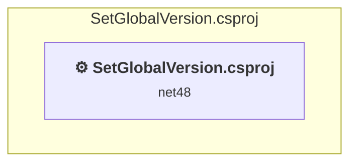

# Projects and dependencies analysis

This document provides a comprehensive overview of the projects and their dependencies in the context of upgrading to .NETCoreApp,Version=v10.0.

## Table of Contents

- [Executive Summary](#executive-Summary)
  - [Highlevel Metrics](#highlevel-metrics)
  - [Projects Compatibility](#projects-compatibility)
  - [Package Compatibility](#package-compatibility)
  - [API Compatibility](#api-compatibility)
- [Aggregate NuGet packages details](#aggregate-nuget-packages-details)
- [Top API Migration Challenges](#top-api-migration-challenges)
  - [Technologies and Features](#technologies-and-features)
  - [Most Frequent API Issues](#most-frequent-api-issues)
- [Projects Relationship Graph](#projects-relationship-graph)
- [Project Details](#project-details)

  - [SetGlobalVersion\SetGlobalVersion.csproj](#setglobalversionsetglobalversioncsproj)

## Executive Summary

### Highlevel Metrics

| Metric | Count | Status |
| :--- | :---: | :--- |
| Total Projects | 1 | All require upgrade |
| Total NuGet Packages | 17 | 6 need upgrade |
| Total Code Files | 11 |  |
| Total Code Files with Incidents | 2 |  |
| Total Lines of Code | 2600 |  |
| Total Number of Issues | 165 |  |
| Estimated LOC to modify | 157+ | at least 6,0% of codebase |

### Projects Compatibility

| Project | Target Framework | Difficulty | Package Issues | API Issues | Est. LOC Impact | Description |
| :--- | :---: | :---: | :---: | :---: | :---: | :--- |
| [SetGlobalVersion\SetGlobalVersion.csproj](#setglobalversionsetglobalversioncsproj) | net48 | 🟡 Medium | 6 | 157 | 157+ | ClassicWpf, Sdk Style = False |

### Package Compatibility

| Status | Count | Percentage |
| :--- | :---: | :---: |
| ✅ Compatible | 11 | 64,7% |
| ⚠️ Incompatible | 5 | 29,4% |
| 🔄 Upgrade Recommended | 1 | 5,9% |
| ***Total NuGet Packages*** | ***17*** | ***100%*** |

### API Compatibility

| Category | Count | Impact |
| :--- | :---: | :--- |
| 🔴 Binary Incompatible | 157 | High - Require code changes |
| 🟡 Source Incompatible | 0 | Medium - Needs re-compilation and potential conflicting API error fixing |
| 🔵 Behavioral change | 0 | Low - Behavioral changes that may require testing at runtime |
| ✅ Compatible | 1117 |  |
| ***Total APIs Analyzed*** | ***1274*** |  |

## Aggregate NuGet packages details

| Package | Current Version | Suggested Version | Projects | Description |
| :--- | :---: | :---: | :--- | :--- |
| Community.VisualStudio.Toolkit.17 | 17.0.507 |  | [SetGlobalVersion.csproj](#setglobalversionsetglobalversioncsproj) | ⚠️NuGet package is incompatible |
| Community.VisualStudio.Toolkit.Analyzers | 1.0.507 |  | [SetGlobalVersion.csproj](#setglobalversionsetglobalversioncsproj) | ✅Compatible |
| Community.VisualStudio.VSCT | 16.0.29.6 |  | [SetGlobalVersion.csproj](#setglobalversionsetglobalversioncsproj) | ⚠️NuGet package is incompatible |
| envdte | 17.9.37000 |  | [SetGlobalVersion.csproj](#setglobalversionsetglobalversioncsproj) | ✅Compatible |
| envdte100 | 17.9.37000 |  | [SetGlobalVersion.csproj](#setglobalversionsetglobalversioncsproj) | ✅Compatible |
| envdte80 | 17.9.37000 |  | [SetGlobalVersion.csproj](#setglobalversionsetglobalversioncsproj) | ✅Compatible |
| envdte90 | 17.9.37000 |  | [SetGlobalVersion.csproj](#setglobalversionsetglobalversioncsproj) | ✅Compatible |
| envdte90a | 17.9.37000 |  | [SetGlobalVersion.csproj](#setglobalversionsetglobalversioncsproj) | ✅Compatible |
| Microsoft.TestPlatform.TestHost | 17.9.0 |  | [SetGlobalVersion.csproj](#setglobalversionsetglobalversioncsproj) | ✅Compatible |
| Microsoft.VisualStudio.CoreUtility | 17.9.187 |  | [SetGlobalVersion.csproj](#setglobalversionsetglobalversioncsproj) | ✅Compatible |
| Microsoft.VisualStudio.Extensibility | 17.9.2092 |  | [SetGlobalVersion.csproj](#setglobalversionsetglobalversioncsproj) | ✅Compatible |
| Microsoft.VisualStudio.SDK | 17.9.37000 | 16.0.208 | [SetGlobalVersion.csproj](#setglobalversionsetglobalversioncsproj) | ⚠️NuGet package is incompatible |
| Microsoft.VisualStudio.Utilities | 17.9.37000 |  | [SetGlobalVersion.csproj](#setglobalversionsetglobalversioncsproj) | ✅Compatible |
| Microsoft.VisualStudio.Utilities.Internal | 16.3.56 |  | [SetGlobalVersion.csproj](#setglobalversionsetglobalversioncsproj) | ✅Compatible |
| Microsoft.VisualStudio.Web.BrowserLink.12.0 | 12.0.0 |  | [SetGlobalVersion.csproj](#setglobalversionsetglobalversioncsproj) | ⚠️NuGet package is incompatible |
| Microsoft.VSSDK.BuildTools | 17.9.3174 | 15.7.104 | [SetGlobalVersion.csproj](#setglobalversionsetglobalversioncsproj) | ⚠️NuGet package is incompatible |
| System.Text.Encodings.Web | 8.0.0 | 10.0.3 | [SetGlobalVersion.csproj](#setglobalversionsetglobalversioncsproj) | NuGet package upgrade is recommended |

## Top API Migration Challenges

### Technologies and Features

| Technology | Issues | Percentage | Migration Path |
| :--- | :---: | :---: | :--- |
| WPF (Windows Presentation Foundation) | 86 | 54,8% | WPF APIs for building Windows desktop applications with XAML-based UI that are available in .NET on Windows. WPF provides rich desktop UI capabilities with data binding and styling. Enable Windows Desktop support: Option 1 (Recommended): Target net9.0-windows; Option 2: Add <UseWindowsDesktop>true</UseWindowsDesktop>. |

### Most Frequent API Issues

| API | Count | Percentage | Category |
| :--- | :---: | :---: | :--- |
| T:System.Windows.Controls.DataGridTextColumn | 30 | 19,1% | Binary Incompatible |
| T:System.Windows.Style | 15 | 9,6% | Binary Incompatible |
| T:System.Windows.RoutedEventArgs | 12 | 7,6% | Binary Incompatible |
| T:System.Windows.Visibility | 9 | 5,7% | Binary Incompatible |
| P:System.Windows.Controls.DataGridColumn.Header | 8 | 5,1% | Binary Incompatible |
| T:System.Windows.Data.Binding | 8 | 5,1% | Binary Incompatible |
| M:System.Windows.Data.Binding.#ctor(System.String) | 8 | 5,1% | Binary Incompatible |
| T:System.Windows.Data.BindingBase | 8 | 5,1% | Binary Incompatible |
| P:System.Windows.Controls.DataGridBoundColumn.Binding | 8 | 5,1% | Binary Incompatible |
| T:System.Windows.Input.ManipulationCompletedEventArgs | 4 | 2,5% | Binary Incompatible |
| T:System.Windows.DependencyPropertyChangedEventHandler | 4 | 2,5% | Binary Incompatible |
| P:System.Windows.Controls.DataGridBoundColumn.ElementStyle | 4 | 2,5% | Binary Incompatible |
| T:System.Windows.TextWrapping | 4 | 2,5% | Binary Incompatible |
| P:System.Windows.UIElement.Visibility | 3 | 1,9% | Binary Incompatible |
| F:System.Windows.Visibility.Visible | 2 | 1,3% | Binary Incompatible |
| P:System.Windows.DependencyPropertyChangedEventArgs.NewValue | 2 | 1,3% | Binary Incompatible |
| E:System.Windows.UIElement.IsVisibleChanged | 2 | 1,3% | Binary Incompatible |
| F:System.Windows.TextWrapping.Wrap | 2 | 1,3% | Binary Incompatible |
| T:System.Windows.Controls.TextBlock | 2 | 1,3% | Binary Incompatible |
| T:System.Windows.DependencyProperty | 2 | 1,3% | Binary Incompatible |
| F:System.Windows.Controls.TextBlock.TextWrappingProperty | 2 | 1,3% | Binary Incompatible |
| T:System.Windows.Setter | 2 | 1,3% | Binary Incompatible |
| M:System.Windows.Setter.#ctor(System.Windows.DependencyProperty,System.Object) | 2 | 1,3% | Binary Incompatible |
| T:System.Windows.SetterBaseCollection | 2 | 1,3% | Binary Incompatible |
| P:System.Windows.Style.Setters | 2 | 1,3% | Binary Incompatible |
| M:System.Windows.Style.#ctor(System.Type) | 2 | 1,3% | Binary Incompatible |
| M:System.Windows.Controls.UserControl.#ctor | 2 | 1,3% | Binary Incompatible |
| M:System.Windows.UIElement.Focus | 1 | 0,6% | Binary Incompatible |
| M:System.Windows.Controls.Primitives.TextBoxBase.SelectAll | 1 | 0,6% | Binary Incompatible |
| T:System.Windows.DependencyPropertyChangedEventArgs | 1 | 0,6% | Binary Incompatible |
| P:System.Windows.DependencyPropertyChangedEventArgs.OldValue | 1 | 0,6% | Binary Incompatible |
| F:System.Windows.Visibility.Hidden | 1 | 0,6% | Binary Incompatible |
| T:System.Windows.Controls.UserControl | 1 | 0,6% | Binary Incompatible |

## Projects Relationship Graph

Legend:
📦 SDK-style project
⚙️ Classic project

## Project Details

### SetGlobalVersion\SetGlobalVersion.csproj

#### Project Info

- **Current Target Framework:** net48
- **Proposed Target Framework:** net10.0-windows
- **SDK-style**: False
- **Project Kind:** ClassicWpf
- **Dependencies**: 0
- **Dependants**: 0
- **Number of Files**: 15
- **Number of Files with Incidents**: 2
- **Lines of Code**: 2600
- **Estimated LOC to modify**: 157+ (at least 6,0% of the project)

#### Dependency Graph

Legend:
📦 SDK-style project
⚙️ Classic project

### API Compatibility

| Category | Count | Impact |
| :--- | :---: | :--- |
| 🔴 Binary Incompatible | 157 | High - Require code changes |
| 🟡 Source Incompatible | 0 | Medium - Needs re-compilation and potential conflicting API error fixing |
| 🔵 Behavioral change | 0 | Low - Behavioral changes that may require testing at runtime |
| ✅ Compatible | 1117 |  |
| ***Total APIs Analyzed*** | ***1274*** |  |

#### Project Technologies and Features

| Technology | Issues | Percentage | Migration Path |
| :--- | :---: | :---: | :--- |
| WPF (Windows Presentation Foundation) | 86 | 54,8% | WPF APIs for building Windows desktop applications with XAML-based UI that are available in .NET on Windows. WPF provides rich desktop UI capabilities with data binding and styling. Enable Windows Desktop support: Option 1 (Recommended): Target net9.0-windows; Option 2: Add <UseWindowsDesktop>true</UseWindowsDesktop>. |

